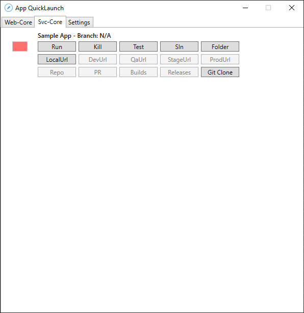

# Overview 
The QuickLauncher is a tool that assists developers in efficiently launching multiple web or service applications for local development. This tool simplifies the process of managing numerous microservices, micro-frontends, or web applications by providing an intuitive GUI that tracks the currently running services. In this context, the QuickLauncher is highly practical and time-saving, and its features are summarized as follows:

- Quick and easy launching of web or service applications via a simple GUI.
- Allows for effortless management of numerous microservices, micro-frontends, or web apps in one place.
- Provides the ability to open application-specific routes and API Swagger, among other URLs, for easy access.
- Simplifies testing by providing an option to run unit tests.
- Supports the addition of new repositories to QuickLaunchConfig.

)

## Getting Started

To get started with QuickLauncher:

1. Update the SourceDirectory in the QuickLaunchConfig file with the base folder that houses all existing repositories.
   - Example: "C:\Users\USERNAME\Code"
2. Re-run QuickLauncher.

## Features

QuickLauncher offers several features that make it a valuable tool for developers, including:

1. **Run**: Runs the web or service application.
   - For Web:
     - {app.RunArguments}
       - Example: "set HTTPS=true&&set port=3000&&npm start"
   - For Services:
     - Example: dotnet run --project {SourceDirectory}/{ProjectFolder} {RunArguments} --urls {AppLocalUrl}
2. **Kill**: Terminates the process if it was executed via QuickLauncher.
3. **Test**: Runs unit tests.
4. **Folder**: Opens the folder.
5. **{Env}Url**: Supports Dev/Qa/Staging/Production.
   - For Web:
     - Opens the application-specific route.
   - For Services:
     - Opens API Swagger.
6. **Repo**: Opens the Azure repository URL.
7. **PR**: Opens the Azure pull-requests URL.
8. **Builds**: Opens the Azure builds URL.
9. **Releases**: Opens the Azure releases URL.
10. **GitClone**: If the repository doesn't exist on your system, it will run a "git clone".
11. **Branch Label**: Automatically updates to your currently checked-out branch.
   - N/A indicates the repository is not cloned.
12. **Red/Green Icon**: Indicates whether the app is currently running via QuickLauncher.

## Adding a New Repository to QuickLauncher

To add a new repository to QuickLauncher:

1. Open QuickLaunchConfig.json.
2. If it's a service/api/function, add a new item to ApplicationServices.
3. If it's a web application, add a new item to ApplicationWebApps.
4. Restart QuickLauncher.